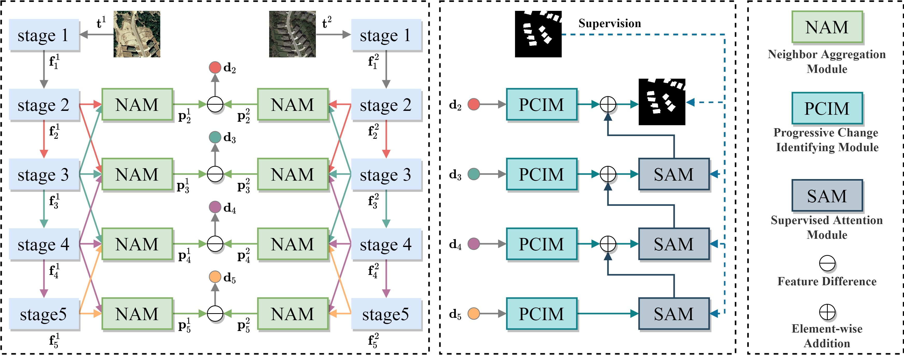
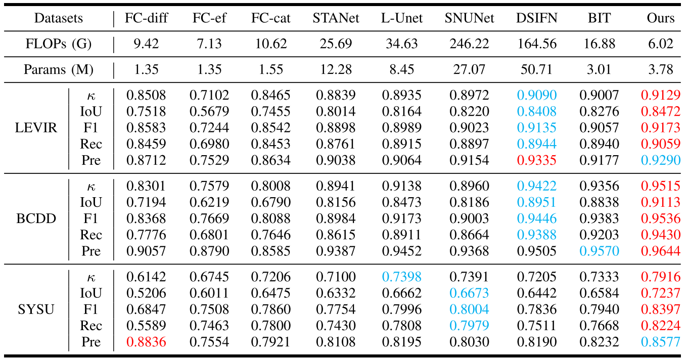

# <p align=center>`Lightweight Remote Sensing Change Detection with Progressive Aggregation and Supervised Attention (IEEE TGRS 2023)`</p>

> **Authors:**
Zhenglai Li, Chang Tang, Xinwang Liu, Wei Zhang, Jie Dou, Lizhe Wang, Albert Zomaya

This repository contains simple python implementation of our paper [A2Net](https://ieeexplore.ieee.org/abstract/document/10034814).

### 1. Overview

<p align="center">
     <br />
</p>

A framework of the proposed A2Net. The temporal features are extracted from a registered pair of images by weight-shared MobileNetV2. Then, we use NAM to merge the temporal features within neighbor stages of the backbone to enhance their feature representation capability. PCIM is designed to capture the temporal change information from bi-temporal features at their corresponding feature levels. We stack SAM on each fusion of low-level and high-level features to polish the details of changed objects. Finally, a change map is obtained by gradually aggregating temporal difference features. <br>

### 2. Usage
+ Prepare the data:
    - Download datasets [LEVIR](https://justchenhao.github.io/LEVIR/), [BCDD](https://study.rsgis.whu.edu.cn/pages/download/building_dataset.html), and [SYSU](https://github.com/liumency/SYSU-CD)
    - Crop LEVIR and BCDD datasets into 256x256 patches
    - Generate list file as `ls -R ./label/* > test.txt`
    - Prepare datasets into following structure and set their path in `train.py` and `test.py`
    ```
    ├─Train
        ├─A        ...jpg/png
        ├─B        ...jpg/png
        ├─label    ...jpg/png
        └─list     ...txt
    ├─Val
        ├─A
        ├─B
        ├─label
        └─list
    ├─Test
        ├─A
        ├─B
        ├─label
        └─list
    ```

+ Prerequisites for Python:
    - Creating a virtual environment in terminal: `conda create -n A2Net python=3.8`
    - Installing necessary packages: `pip install -r requirements.txt `

+ Train/Test
    - `sh ./tools/train.sh`
    - `sh ./tools/test.sh`

### 3. Change Detection Results
<p align="center">
     <br />
    <em> 
    Quantitative comparisons in terms of $\kappa$, IoU, F1, OA, Rec, and Pre on three remote sensing change detection datasets. The best and second best results are highlighted in <font color="#FF0000">red</font> and <font color="#00B0F0">blue</font>, respectively.
    </em>
</p>

### 4. Acknowlogdement
This repository is built under the help of the projects [BIT_CD](https://github.com/justchenhao/BIT_CD), 
[CDLab](https://github.com/Bobholamovic/CDLab), and [MobileSal](https://github.com/yuhuan-wu/MobileSal) for academic use only.

### 5. Citation

Please cite our paper if you find the work useful:

    @article{Li_2023_A2Net,
         author={Li, Zhenglai and Tang, Chang and Liu, Xinwang and Zhang, Wei and Dou, Jie and Wang, Lizhe and Zomaya, Albert Y.},
        journal={IEEE Transactions on Geoscience and Remote Sensing}, 
        title={Lightweight Remote Sensing Change Detection With Progressive Feature Aggregation and Supervised Attention}, 
        year={2023},
        volume={61},
        number={},
        pages={1-12},
        doi={10.1109/TGRS.2023.3241436}
        }

